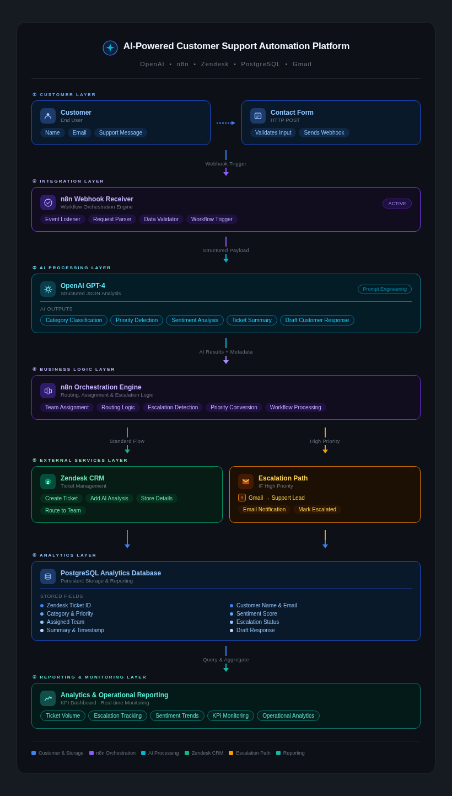

<div align="center">

# AI Customer Support Automation Platform

**End-to-end AI-powered ticket triage, routing, escalation, and analytics**


</div>

---

## Overview

This project is a production-grade AI customer support automation platform that replaces manual ticket triage with an intelligent, fully automated pipeline. When a customer submits a support request, the system classifies the issue, detects priority and sentiment, drafts a response, routes the ticket to the correct team, creates a Zendesk ticket with full AI context, triggers escalation alerts via Gmail for high-priority cases, and stores everything in PostgreSQL for analytics and reporting — all without human intervention.

Built as a portfolio project to demonstrate real-world AI automation engineering using **n8n**, **OpenAI**, **Zendesk**, **PostgreSQL**, and **Gmail**.

---

## Architecture


The platform is structured across seven layers:

| Layer | Components |
|---|---|
| Customer | Contact Form → Webhook |
| Integration | n8n Workflow Engine |
| AI Processing | OpenAI GPT-4 (Classification, Priority, Sentiment, Summary, Draft Reply) |
| Business Logic | Team Assignment, Routing, Escalation Detection, Priority Conversion |
| External Services | Zendesk CRM · Gmail Escalation Notifications |
| Analytics | PostgreSQL Database |
| Reporting | Ticket Volume · Escalation Tracking · Sentiment Trends · KPI Monitoring |

---

## How It Works

1. **Customer submits** a support request via a contact form
2. **n8n Webhook** receives the request and triggers the automation pipeline
3. **OpenAI GPT-4** analyzes the ticket content and returns structured JSON:
   - Category classification (Billing, Claims, Policy, Technical, Account, General)
   - Priority level (Low / Medium / High / Critical)
   - Sentiment score (Positive / Neutral / Negative)
   - Ticket summary
   - Draft customer response
4. **Business logic layer** processes the AI output:
   - Assigns the ticket to the appropriate support team
   - Converts priority to Zendesk-compatible format
   - Detects escalation conditions
5. **Zendesk integration** automatically:
   - Creates a new support ticket
   - Attaches full AI analysis and metadata
   - Routes the ticket to the correct team queue
6. **Escalation workflow** — if high priority:
   - Sends a Gmail notification to the support lead
   - Flags the ticket as escalated in Zendesk
7. **PostgreSQL** stores all ticket data for analytics:
   - Ticket ID, customer details, category, priority, sentiment, team, escalation status, timestamp
8. **Reporting layer** enables operational insights:
   - Ticket volume trends, escalation rates, sentiment analysis, KPI monitoring

---

## Features

- **AI ticket classification** — automatically categorises every incoming request
- **Priority detection** — identifies urgency from message content
- **Sentiment analysis** — tracks customer emotional state at scale
- **Draft response generation** — AI-written reply suggestions for agents
- **Automated team routing** — Billing, Claims, Policy, Technical, Account, General Support
- **Zendesk ticket creation** — full ticket lifecycle from webhook to CRM
- **Escalation handling** — high-priority tickets trigger instant Gmail alerts
- **PostgreSQL analytics** — persistent storage for operational reporting
- **Structured JSON processing** — reliable, parseable AI outputs
- **Webhook-based architecture** — event-driven, stateless, horizontally scalable

---

## Example AI Output

```json
{
  "category": "Account Access",
  "priority": "High",
  "zendeskPriority": "urgent",
  "sentiment": "Negative",
  "assigned_team": "Account Support Team",
  "escalated": true,
  "summary": "Customer is locked out of their account and needs urgent access restored.",
  "draft_reply": "Dear [Customer], we understand the urgency of your situation. Our Account Support Team has been notified and will prioritise your case. Please allow up to 1 hour for resolution."
}
```

---

## Tech Stack

| Technology | Role |
|---|---|
| [n8n](https://n8n.io) | Workflow orchestration and automation engine |
| [OpenAI API](https://platform.openai.com) | AI analysis — classification, sentiment, drafting |
| [Zendesk API](https://developer.zendesk.com) | Ticket creation, routing, and CRM management |
| [PostgreSQL](https://www.postgresql.org) | Analytics database and operational reporting |
| [Gmail API](https://developers.google.com/gmail) | Escalation email notifications |
| [Docker](https://www.docker.com) | Containerised local deployment |
| REST APIs / Webhooks | Event-driven integration layer |
| Prompt Engineering | Structured JSON output from GPT-4 |

---

## Getting Started

### Prerequisites

- [Docker](https://www.docker.com/get-started) installed
- OpenAI API key
- Zendesk account with API access
- Gmail account configured for SMTP/API
- PostgreSQL instance (local or cloud)

### Setup

```bash
# Clone the repository
git clone https://github.com/hamzaahmedsiddiqui/AI-customer-support-automation.git
cd AI-customer-support-automation

# Start n8n with Docker
docker compose up -d

# Access n8n
open http://localhost:5678
```

Import the workflow file (`workflow.json`) into n8n and configure the following credentials:

- `OpenAI API` — API key from platform.openai.com
- `Zendesk API` — subdomain + API token
- `Gmail` — OAuth2 or app password
- `PostgreSQL` — connection string

---

## Project Structure

```
├── workflow.json          # n8n workflow export
├── architecture.html      # Interactive architecture diagram
├── images/
│   └── architecture.png   # Architecture diagram (README)
├── docker-compose.yml     # n8n Docker setup
└── README.md
```

---

## Author

**Hamza Ahmed Siddiqui**
Software Engineer · AI & Workflow Automation · AWS Cloud

[](https://linkedin.com/in/hamzaahmedsiddiqui/)